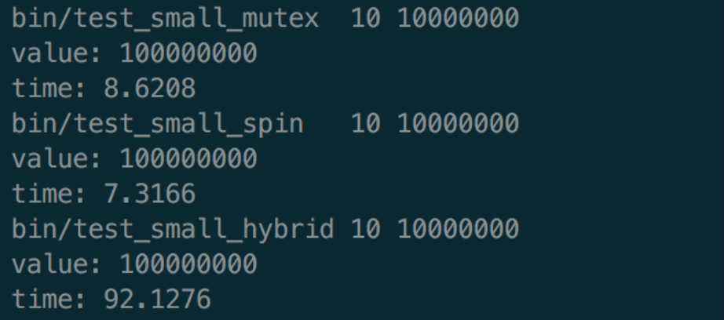
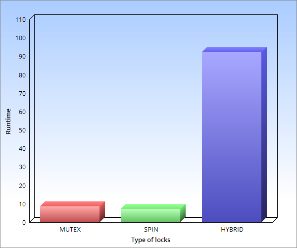
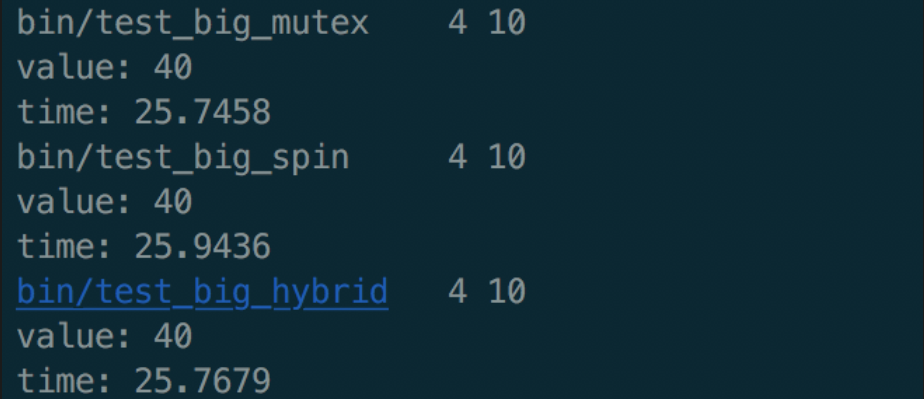
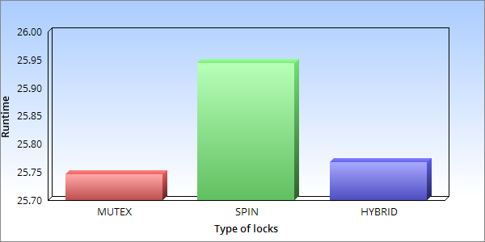

# Lock efficiency comparison, Spin lock, Mutex, and Hybrid Lock
## System Programming Assignment, Lock

작성자 : 김영진 2016025241, 김정현 2014004448

Github repository : https://github.com/smilu97/system-hyu

### 목표

Lock 획득 대기 중, 일정 시간은 spin하고, 일정 시간이 지난 후에는 thread를 차단하는 lock을 구현한다. Lock 획득 대기 시, 1초 동안 spin하면서 대기하며, 1초가 지나도 lock을 획득하지 못하면 해당 thread를 차단한다. 이러한 lock을 Hybrid lock이라고 하며, 이를 초기화, 잠금, 잠금해제, 삭제하는 함수를 생성한다.

각각의 test1과 test2 프로그램에 대해서, 각기 다른 세 가지 lock을 사용하여 critical section을 보호하였을 때의 성능 차이를 구한다. 각 lock을 사용하였을 때, 소요되는 runtime을 그래프를 이용하여 분석한다. 

### 기본 함수 및 구조

#### Structure : struct hybrid lock

	typedef struct {
	    pthread_mutex_t _m;
	    pthread_spinlock_t _s;
	} hybrid_lock_t;

hybrid_lock은 spin lock과 mutex를 복합적으로 사용하여 구현한다. 따라서 pthread_mutex, pthread_spinlock 두 가지 변수가 존재한다. 구조체 자체는 hybrid_lock_t라는 구조체 변수로 선언한다.

#### Initialization : void hybrid_lock_init(hybrid_lock_t * lock);

	void hybrid_lock_init(hybrid_lock_t * lock)
	{
	    pthread_mutex_init(&(lock->_m), NULL);
	    pthread_spin_init(&(lock->_s), 0);
	}

hybrid_lock_t을 초기화하기 위해서는 구조체 내의 lock을 초기화한다. spin_lock과 mutex에 대해 기존에 존재하는 초기화 함수를 이용하여 초기화한다. 

#### Lock : void hybrid_lock_lock(hybrid _lock_t * lock);

	void hybrid_lock_lock(hybrid_lock_t * lock)
    {
        struct timeval begin, end;
        double try_cost;
        unsigned long long try_count = 100;

        gettimeofday(&begin, NULL);
        while(try_count--) {
            if(pthread_spin_trylock(&(lock->_s)) == 0) {
                if(pthread_mutex_trylock(&(lock->_m)) != 0) {
                    pthread_spin_unlock(&(lock->_s));
                    continue;
                }
                return;
            }
        }
        gettimeofday(&end, NULL);

        try_cost = (end.tv_sec - begin.tv_sec) + (end.tv_usec - begin.tv_usec) / 1000000.0f;
        try_count = (unsigned long long)(100.0f / try_cost);

    #ifdef PPRINT
        printf("try_cost: %.10f\n", try_cost);
        printf("try_count: %d\n", try_count);
    #endif

        while(try_count--) {
            if(pthread_spin_trylock(&(lock->_s)) == 0) {
                if(pthread_mutex_trylock(&(lock->_m)) != 0) {
                    pthread_spin_unlock(&(lock->_s));
                    continue;
                }
                return;
            }
        }

    #ifdef PPRINT
        printf("begin to mutex lock\n");
    #endif

        pthread_mutex_lock(&(lock->_m));
        pthread_spin_lock(&(lock->_s));
    }

hybrid_lock_t 를 획득하기 위해 대기할 때, 1초 동안 spin_lock을 이용하여 lock을 대기한다. 이를 구현하기 위해 spin_trylock을 이용하여 lock 획득을 시도한다. 

1초가 지나도 lock을 획득하지 못하였다면, 해당 thread를 차단한다.

만약 lock을 획득한다면, mutex를 획득하기 위해  mutex_trylock을 실행한다. mutex도 획득을 하게 되면 함수를 종료한다.

#### Unlock : void hybrid_lock_unlock(hybrid_lock_t * lock);

	void hybrid_lock_unlock(hybrid_lock_t * lock)
	{
	    pthread_mutex_unlock(&(lock->_m));
	    pthread_spin_unlock(&(lock->_s));
	}

현재 hybrid_lock_t 내부에서 각각 획득되어 있는 mutex와 spin_lock을 해제하는 함수다. 초기화하는 함수와 마찬가지로 각 lock에 대한 기존의 unlock함수를 이용하여 잠금을 해제한다.

#### Destruction : void hybrid_lock_destroy(hybrid_lock_t * lock);

	void hybrid_lock_destroy(hybrid_lock_t * lock)
	{
	    pthread_mutex_destroy(&(lock->_m));
	    pthread_spin_destroy(&(lock->_s));
	}

현재 hybird_lock_t 내부에 존재하는 mutex와 spin_lock을 소멸시킨다. 각 lock에 대한 기존의 destroy함수를 이용하여 잠금을 해제한다. hybrid_lock_destroy 함수는 hybrid_lock_t 구조체를 메모리에서 free해주기 전에 없애야 lock의 자원에 대한 정보를 잃지 않는다.

### 결과1 test_small(test1)

 

프로그램 test1에 대한 runtime의 결과와 그에 대한 bar graph는 위와 같다. 실행 순서는 mutex, spin_lock, hybrid_lock 순서로 진행하였다. 실행 결과, spin_lock의 결과가 가장 좋았으며, mutex가 다음이었고, hybird_lock의 경우엔 결과값이 기하급수적으로 증가하였다. 

여기서 주목해야 할 점은, hybrid_lock으로 구현하는 것이 소요 시간이 가장 길었다는 점이다. 이는 hybrid_lock을 구현하는 데에 생긴 spin_trylock의 overhead가 매우 크기 때문이다. 또한 gettimeofday를 호출함으로 인해 발생하는 overhead도 결과에 영향을 미친다.

추가적으로 각각의 lock이 잡아주는 critical section의 크기에 의해서도 runtime의 차이가 발생할 수 있다. 이에 대한 결론은 아래 '결과2'에서 함께 분석하였다.

### 결과2 test_big(test2)

 

프로그램 test1에 대한 runtime의 결과와 그에 대한 bar graph는 위와 같다. 실행 순서는 mutex, spin_lock, hybrid_lock 순서로 진행하였다. 실행 결과, test1만큼 결과의 차이가 발생하진 않았다. 순서대로 mutex, hybird_lock, spin_lock 순서대로 효율이 좋았다.

위와 같은 결과가 생성된 이유로는, hybrid_lock에서 잡아주는 lock의 횟수가 적었기 때문으로 분석된다. lock의 횟수가 적은 이유로는 lock을 잡아주는 critical section의 크기가 test1의 경우보다 크기 때문이다. test1의 경우, critical section의 사이즈가 매우 작았다. 따라서 lock의 횟수가 많았기 때문에 hybrid_lock의 실행 시간이 기하급수적으로 증가한 것이다. 반면 test2의 경우, critical section의 사이즈가 test1에 비해서 크다. 따라서 thread를 즉시 차단하는 mutex, 1초 이후에 thread를 차단하는 hybrid_lock, 그리고 계속해서 busy_waiting을 하는 spin_lock 순서로 효율이 발생하는 것이다.  

또한 spin_lock은 thread의 갯수가 적을때 효율이 좋다는 이론적인 결과가 적용된 것으로 분석하였다.

### 결과3 gettimeofday 효율

