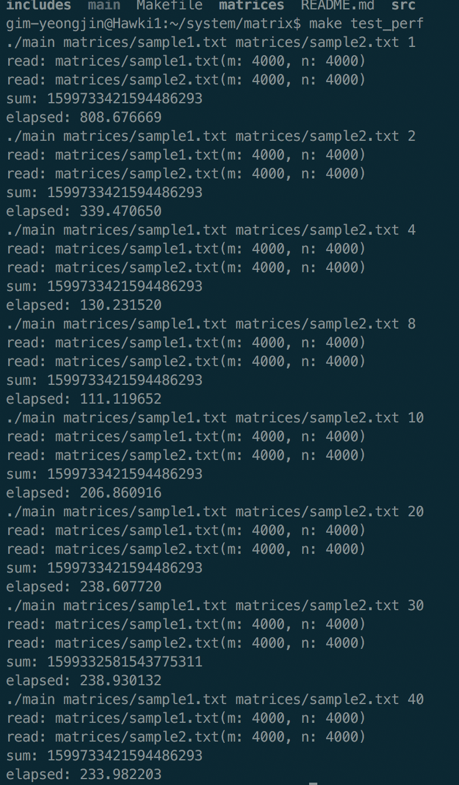
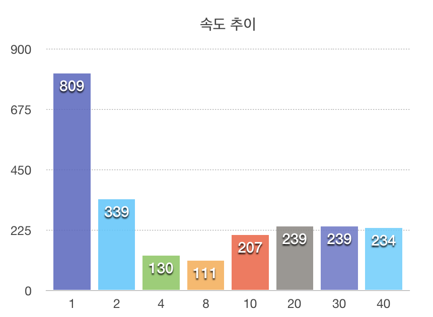
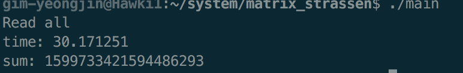
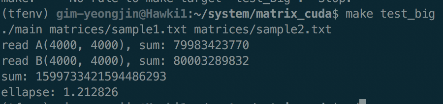

# Matrix multiplication using multi-threading approach

작성자: 김영진 2016025241, 김정현 2014004448

Github Repo: https://github.com/smilu97/system-hyu

### 목표

Multi-threading approach을 이용한 행렬 곱셈의 속도를 개선한다.

### 방법

현재 대부분의 컴퓨터에는 한 개의 CPU에 다수의 코어가 들어있다.

그렇기 때문에 운영체제에서는 동시에 여러 개의 thread를 처리할 수 있도록 지원해주고, 독립적으로 실행가능한 작업들은 그것들을 각각 다른 thread에 분리시켜준다. 따라서, 여러 코어를 사용가능하게 만들어줌으로써, 이론적으로는 single thread로 처리하는 것에 비해 배로 성능을 향상시킬 수 있다.

Matrix A, B, C에 대하여 $`A*B=C`$ 를 수행한다고 할 때, A와 B에서는 read밖에 일어나지 않으므로 C에 write하는 부분을 여러 조각으로 나눌 수 있는데, 단순히 C에 들어갈 각 원소의 자리마다 나눌 수 있다.

### pthread 라이브러리

Multi-threading을 위해 지원되는 라이브러리이다. gcc 옵션에서 링크옵션을 추가적으로 걸어줘야 한다.

#### [pthread_create](http://man7.org/linux/man-pages/man3/pthread_create.3.html)

Thread를 생성하는 순간부터 새로운 작업을 시작한다.

#### [pthread_join](http://man7.org/linux/man-pages/man3/pthread_join.3.html)

Thread에 등록한 작업이 끝날 때 까지 기다린다.

#### [pthread_barrier](https://www.gnu.org/software/gnuastro/manual/html_node/Implementation-of-pthread_005fbarrier.html)

pthread_barrier_t 에 특정 개수의 wait가 들어가기 전까지 wait를 건 모든 thread가 대기하는 것으로 보인다.

또한 OSX의 gcc에서 지원하지 않고 man7.org에서 나오지 않는 것으로보아 운영체제마다 지원하지 않는 경우도 있는 것으로 보인다.

### 결과1

#### Naive multi-threading

 

Thread가 너무 적어도, 많아도 성능이 좋지 않았으며, 8 threads에서 가장 성능이 좋았고, 20threads 이상부터는 비슷한 성능을 보여주었다. (단위: 초)

### 결과2

#### 슈트라센 알고리즘 (Strassen algorithm)

([matrix_strassen](../../matrix_strassen) 에 구현되어있음)

행렬 곱셈의 경우 Naive한 알고리즘의 경우 $`O(N^3)`$ 의 시간이 드는 것으로 알려져있다. 하지만 알려진 [몇몇 알고리즘들](https://ko.wikipedia.org/wiki/슈트라센_알고리즘)은 이것을 약 $`O(N^{2.795})`$ 정도로 줄였고, 현재 가장 빠른 알고리즘은 $`O(n^{2.3737})`$ 정도 시간에 처리할 수 있다고 한다.

필자는 $`O(N^{2.795})`$ 의 복잡도를 가진 것으로 알려진 슈트라센 알고리즘을 구현하여 성능을 비교해 보았다. 

위는 8 threads로 동작하는 슈트라센 알고리즘을 구현하여 테스트 해본 결과이다. 기록해두지는 않았지만 슈트라센 알고리즘을 사용하였을 경우 multi-threading 없이 108초 정도가 나왔으며, 8 threads로 나누어본 결과 30초 정도에 수행하는 것을 볼 수 있었다.

#### GPGPU (General-purpose computing on Graphics Processing Units)

([matrix_cuda](../../matrix_cuda) 에 구현되어있음)

최근의 GPU들은 컴퓨팅 모드를 지원하는데, 이것을 이용해 아주 많은 코어를 이용해 산술연산을 수행할 수 있다. NVIDIA사의 제품의 경우 CUDA라는 라이브러리를 제공하며, 이를 이용해서, GPGPU를 수행하는 프로그램을 만들 수 있다.

GTX 1060 환경에서 Naive알고리즘으로 1.2초 정도가 걸렸다.

유명한 딥러닝 프레임워크중의 하나인 Tensorflow에서는 특정 옵션을 발현할 경우, GPGPU모드로 Naive 알고리즘보다 더 나은 성능의 알고리즘을 수행해주는 것으로 알려져있는데, 이것을 이용하면 더 빠르게 할 수 있을 것으로 보인다.
