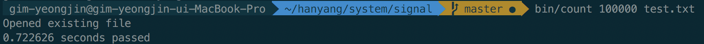

# #3 프로그램이 갑자기 종료되지 않도록 제어해보자

* Related file: [src/mysignaltest.c](/signal/src/mysignaltest.c) => sigtest

### 목적

프로그램이 5초 뒤에 종료된다. 그런데 Ctrl-C가 눌리면 특정 함수가 호출되는데, 이 함수는 5초가 더 넘게 걸린다. 함수가 하던 일이 멈춰지고 도중에 종료되면 에러가 날 수 있으므로, 함수가 실행중이면 5초가 지나도 종료되지 않고 이 함수를 기다리게 한다.

### 해결방법

* sig_int가 시작될때, 전역변수를 하나 잡아서 `doing_sig_int` 값을 1로 만든다.
* 알람에 대한 핸들러가 doing_sig_int가 1이면 종료시키지 않고 그냥 리턴한다.

